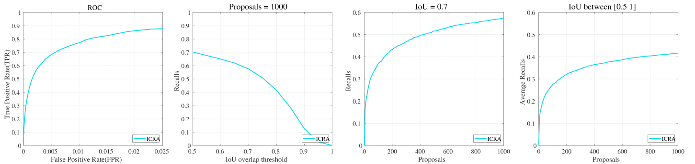

# Tiny-Obstacle-Discovery

Created by Feng Xue

Official Matlab Implementation for "[A Novel Multi-layer Framework for Tiny Obstacle Discovery](https://arxiv.org/abs/1904.10161v3)", ICRA 2019


## Introduction

This repository contains the official Matlab implementation for "A Novel Multi-layer Framework for Tiny Obstacle Discovery". This paper has been accepted by IEEE International Conference on Robotics and Automation (ICRA) 2019. And the the official Python/ROS implementation is coming soon.

**Note:** This version has been slightly improved on the basis of the original work, mainly including the following points:

 - Training code is slightly changed, ROC performance is improved.
 - For higher efficiency, the basic edge detection algorithm uses structured edge detection.
 - The modules in the system are largely accelerated, although there is still a lot of room for improvement.
 - To be consistent with other works in community, in the instance-level evaluation, the IoU is defined as the Intersection over Union between predicted proposals and the ground truth bounding boxes,


## Citation

If you find the paper or the code useful, please cite our paper:

```
@INPROCEEDINGS{Xue_ICRA_2019,
Author = {Feng Xue, Anlong Ming, Menghan Zhou and Yu Zhou},
booktitle={2019 International Conference on Robotics and Automation (ICRA)},
title={A Novel Multi-layer Framework for Tiny Obstacle Discovery},
year={2019},
}
```

## Data Preparation
### Lost and Found Dataset (LAF)

You may download the original images from [here](http://www.dhbw-stuttgart.de/~sgehrig/lostAndFoundDataset/leftImg8bit.zip) and annotations from [here](http://www.dhbw-stuttgart.de/~sgehrig/lostAndFoundDataset/gtCoarse.zip). Then, you will have the following directory structure:
```
lostandfound
|_ leftImg8bit
|  |_ test
|  |  |_ 02_Hanns_Klemm_Str_44
|  |  |_ ...
|  |  |_ 15_Rechbergstr_Deckenpfronn
|  |_ train
|  |  |_ 01_Hanns_Klemm_Str_45
|  |  |_ ...
|  |  |_ 14_Otto_Lilienthal_Str_24
|_ gtCoarse 
|  |_ test
|  |  |_ 02_Hanns_Klemm_Str_44
|  |  |_ ...
|  |  |_ 15_Rechbergstr_Deckenpfronn
|  |_ train
|  |  |_ 01_Hanns_Klemm_Str_45
|  |  |_ ...
|  |  |_ 14_Otto_Lilienthal_Str_24
```

## Testing
For testing the algorithm on lost and found dataset, you can run the script in MATLAB:
```
./test.m
```

## Training
For Training the algorithm on lost and found dataset, you can run the script in MATLAB:
```
./train.m
```

## Evaluation


#### Option
For visualization, to run the script:
```
./result/figuredraw.m
```
The performances are presented as follows:



# News

2019/12/24, we are applying for the license.
The code will be released after we obtain the license.
